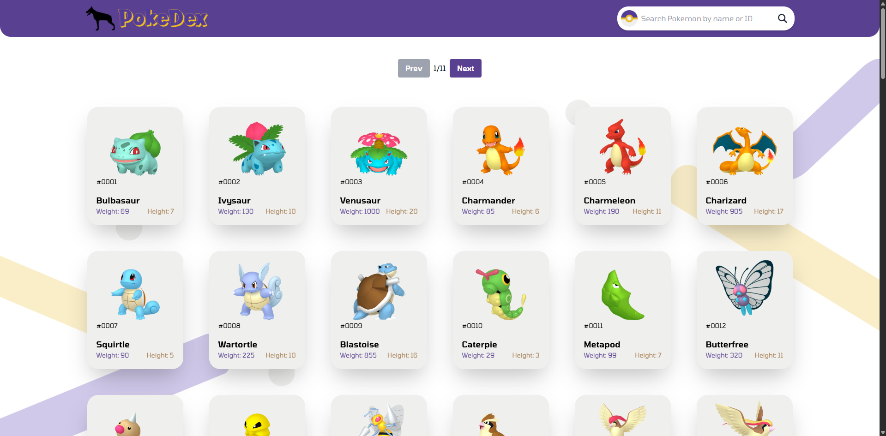
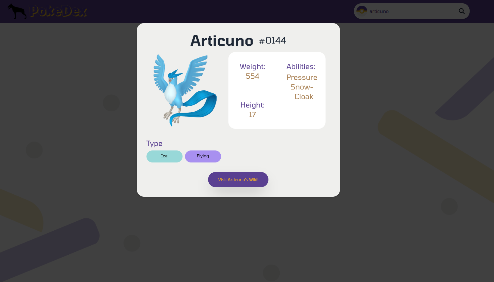

# 📌 Projeto: Pokedex com React

---

## 🚀 Descrição
Este projeto é uma aplicação desenvolvida em React que simula uma Pokédex. A aplicação consome dados da **PokeAPI** para listar, buscar e exibir informações de Pokémon de forma interativa.

---

## 🎯 Funcionalidades
- ✅ Listagem de Pokémon usando API pública
- 🔍 Busca de Pokémon por nome
- 📄 Exibição de nome, imagem e tipo dos Pokémon
- ⚛️ Utilização de `useState` e `useEffect` para controle de estado e efeitos
- 🖼️ Renderização dinâmica de cards para cada Pokémon
- 📈 Requisições HTTP utilizando `fetch`

---

## 📷 Preview do Projeto

### 🏠 Tela Inicial


### 🔎 Tela de Detalhes


---

## 🛠 Tecnologias Utilizadas
- ⚛️ React.js
- 📜 JavaScript (ES6+)
- 🎨 HTML5 / CSS3
- 🌐 [PokeAPI](https://pokeapi.co/)

---

## 📂 Estrutura do Projeto
📂 src
 ┣ 📂 components
 ┃ ┣ 📜 PokemonList.jsx
 ┃ ┗ 📜 PokemonCard.jsx
 ┣ 📜 App.jsx
 ┣ 📜 index.js
 ┣ 📜 App.css
 ┗ 📜 index.css

---

## 📥 Instalação e Execução
### ✅ Pré-requisitos
- [Node.js](https://nodejs.org/) instalado
- [npm](https://www.npmjs.com/) ou [yarn](https://yarnpkg.com/) instalado

### 📌 Passos para rodar o projeto
1. Clone o repositório:
   ```sh
   git clone https://github.com/LeonardoFSousa/Projeto_PokeDex
   ```
2. Entre na pasta do projeto:
   ```sh
   cd Projeto_PokeDex
   ```
3. Instale as dependências:
   ```sh
   npm install
   ```
4. Inicie o servidor de desenvolvimento:
   ```sh
   npm start
   ```
5. Acesse o projeto no navegador: `http://localhost:3000/`

---

## 🎮 Como Usar
1. **📜 Listagem Inicial:** A aplicação carregará uma lista inicial de Pokémon ao ser aberta.
2. **🔍 Pesquisa:** Utilize o campo de busca para pesquisar Pokémon pelo nome.
3. **🖼️ Visualização:** Cada Pokémon será apresentado em um card com nome, imagem e tipo.

---

## ⚛️ Hooks Utilizados
- `useState`: Gerenciamento dos estados de busca e listagem de Pokémon.
- `useEffect`: Requisição dos dados da PokeAPI ao carregar o app e em atualizações de busca.
